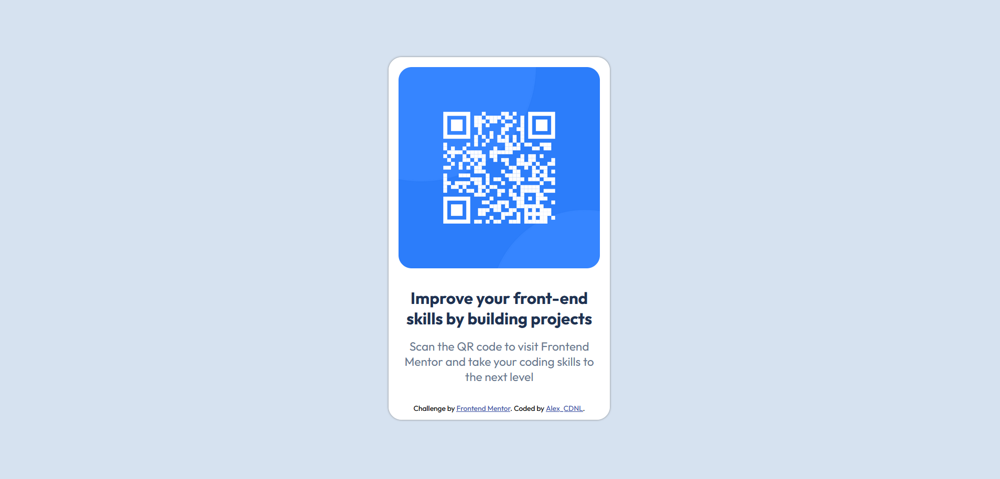

# Frontend Mentor - QR code component solution

This is a solution to the [QR code component challenge on Frontend Mentor](https://www.frontendmentor.io/challenges/qr-code-component-iux_sIO_H). Frontend Mentor challenges help you improve your coding skills by building realistic projects.

## Table of contents

- [Screenshot](#screenshot)
- [Links](#links)
- [My process](#my-process)
  - [Built with](#built-with)
  - [What I learned](#what-i-learned)
  - [Continued development](#continued-development)
  - [Useful resources](#useful-resources)
- [Author](#author)
- [Acknowledgments](#acknowledgments)

### Screenshot

### Links

- Solution URL: [Add solution URL here](https://your-solution-url.com)
- Live Site URL: [Add live site URL here](https://your-live-site-url.com)

## My process

I started with HTML, then CSS desktop, then mobile version.

### Built with

- Semantic HTML5 markup
- CSS custom properties
- Flexbox

### What I learned

I learned about Git and github, how to commit and push.
Learn about doing a basic HTML page and basic CSS style.
Learn to import font.
Learn about parent and child element.
Learn about finding informations like official documentation, stack overflow.

### Continued development

Need to keep learning about some basic semantic like h1, h2 etc. Being more fluid in my code, I think I can have the same result especially in CSS way faster and with less lines. Be more organize in my code. Also I need to have a better understanding of designs to see my HTML skeleton only with it.

### Useful resources

- (https://www.freecodecamp.org/news/how-to-link-css-to-html/ ) - This helped me for link css to html
- (https://css-tricks.com/snippets/css/a-guide-to-flexbox/) - Help me use flexbox
- (https://stackoverflow.com/questions/2279519/how-to-get-main-div-container-to-align-to-centre) - Help me fix main container in center.
- (https://developer.mozilla.org/fr/docs/Learn_web_development/Core/CSS_layout/Responsive_Design) - Help me with responsive design.
- (https://www.w3schools.com/css/css_rwd_mediaqueries.asp) - Help me use breakpoint.

## Author

- Website - [Alex CDNL](https://qrcodecomponent-alexcdnl.netlify.app/)
- Frontend Mentor - [@Alex-CDNL](https://www.frontendmentor.io/profile/Alex-CDNL)

## Acknowledgments

For the first project I did it 100% alone without watching someone solution or youtube video on this project. But thanks to people on stack overflow, thanks to front end mentor with all the nice documentation !
